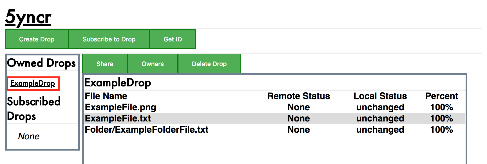
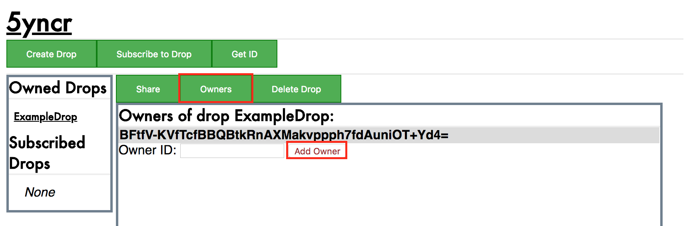
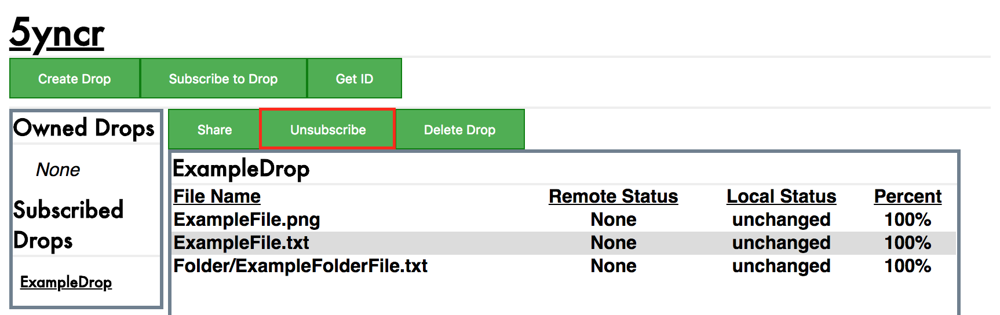
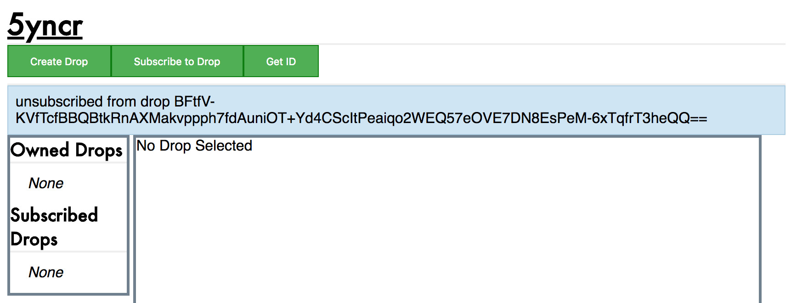
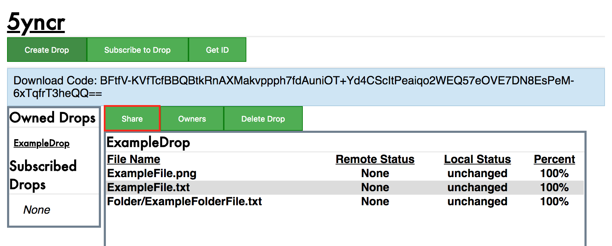
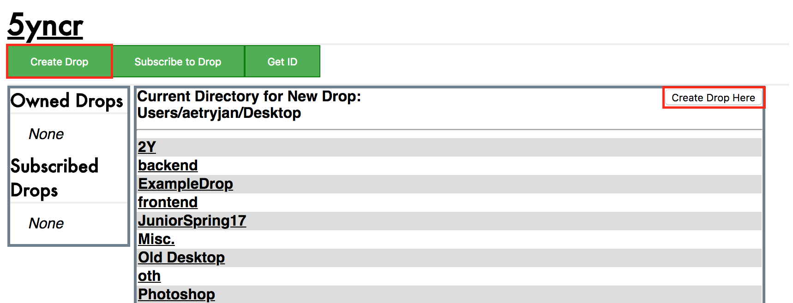
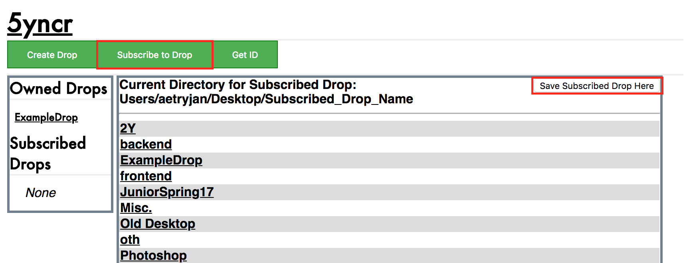
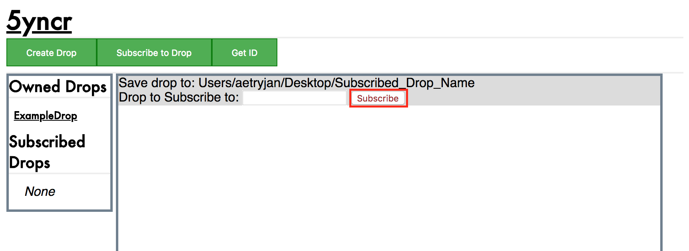
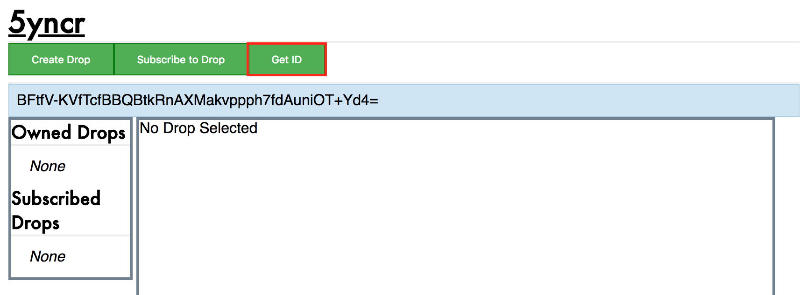
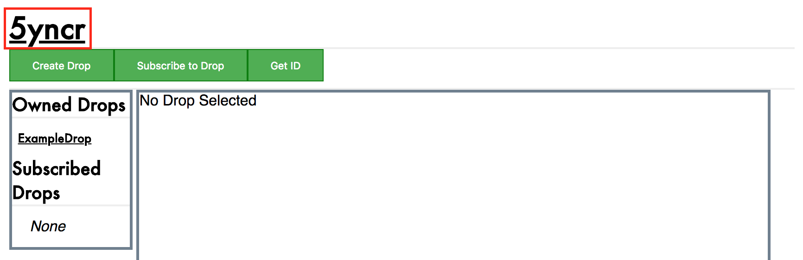

User Manual
===========

The following is a brief manual outlining the functionalities of the flask
app.

Sidebar
-------

The sidebar consists of two sections: **Owned Drops** and
**Subscribed Drops**. Each section contains a list of
drops that the user owns or are subscribed to, respectively.

Click on any of the drops in the sidebar to view their contents.
An example of this is shown below, by clicking the button in the red square:

Owner Buttons
-------------

- **Update Drop to the Current Version**

    The *Version* button will only appear if the drop has
    been modified. That being said, clicking the button will
    update the drop and its metadata information to

- **View and Manage other Owners**

    The *Owners* button displays all current owners of the
    drop. More specifically, it shows their Node IDs.
    By clicking it, the main UI panel updates to
    show both primary and secondary owners. To add an owner
    to the drop, input the new owner's Node ID into the
    *Owner ID* text field, then click the *Add Owner* button.
    This interface is shown below:

Subscriber Buttons
------------------

- **Unsubscribe from the Current Drop**

    The *Unsubscribe* button makes it so that a user no longer
    receives updates to a drop. The drop directory does **not**
    get deleted, and its version is the most recently downloaded
    version prior to unsubscribing. After unsubscribing, a message
    is shown to the user, displaying the Drop ID of the drop that they
    unsubscribed from.

    The first image shows how to unsubscribe from a drop, while the second
    shows the unsubscribe message sent to the user.

General User Buttons
--------------------

- **Share the Node ID**

    The *Share* button is available for both owned and
    subscribed drops. Clicking it will show a message
    displaying the drop's unique Drop ID.

    5yncr does not provide any utilities to message
    between individuals. In order to send the Drop ID
    to peers, you must do so through email / word of
    mouth / etc.

    An example of clicking the *Share* button is shown below.
    The string following the "Download Code" section is the Drop ID:

- **Create a Drop**

    The *Create Drop* button is available upon opening
    the 5yncr webpage, and is located next to the **5yncr**
    title. To create a drop, do the following:

    1) Create a local directory that will house the drop. Remember
    the file path.

    2) Click on *Create Drop*. The main UI panel will display
    directories on your computer.

    3) Click on the directories in the main UI panel
    until the file path at the top of the main UI panel
    is the same as the file path before.

    4) Click the *Create Drop Here* button.

    An example of creating a drop is shown here:

- **Subscribe to a Drop**

    The *Subscribe Drop* button is available upon opening
    the 5yncr webpage, and is located next to the **5yncr**
    title. To subscribe to a drop, do the following:

    1) Create a local directory that will house the drop. Remember
    the file path.

    2) Click on *Subscribe to Drop*. The main UI panel will display
    directories on your computer.

    3) Click on the directories in the main UI panel
    until the file path at the top of the main UI panel
    is the same as the file path before.

    4) Click on *Save Subscribed Drop Here*. The main UI panel will be updated
    to show a text field.

    5) Input a Drop ID into the text field.

    6) Click the *Subscribe* button.

    The first image represents steps 1 through 4, while the second represents
    steps 5 and 6:

- **Get Node ID**

    The *Get ID* button is available upon opening the 5yncr
    webpage, and is located next to the **5yncr** title.
    Clicking this button shows the user's Node ID (in the blue field),
    which can then be sent to others so that they may add the user as
    an owner. An example of this is shown below:

- **Delete the Drop**

    The *Delete Drop* button is available for both owned and
    subscribed drops. Clicking it will result in an alert appearing.
    Clicking 'Yes' on the alert will delete the drop directory and
    all of its contents from your computer.

- **Redirect to the Main Webpage**

    To redirect to the main webpage, click the **5yncr** title.
    This button is shown in the following image:

